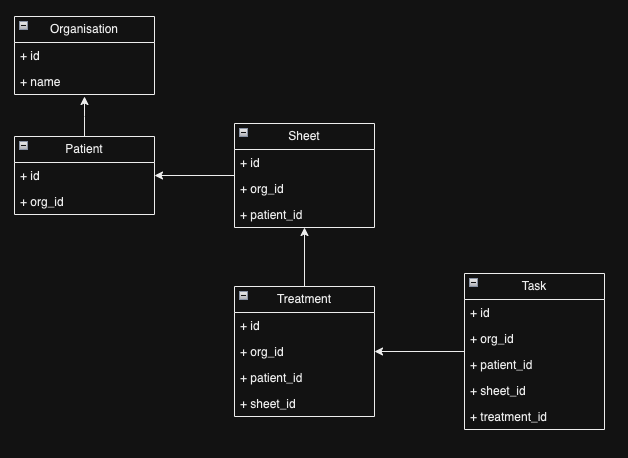
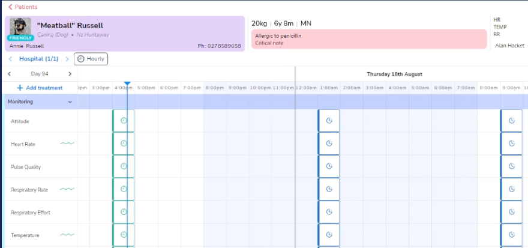

# Current Architecture

- NoSQL DB - AWS DynamoDB
- Ver Radar implemented a repository pattern
  - Data queried via an entity ex `Patient.getSingle(org_id, patient_id)`
- Every `entity` was a separate table. _Did not implement single|one table NoSQL pattern_
- Implementation mimicked more traditional RDS data storage

