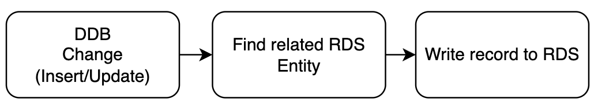

# Implementation

Revisiting our engineering requirements

- ❤️‍🩹 **Developer Ex** - Should not be difficult for engineers
- 🧹 **Maintenance** - Easy for engineers to maintain

The above requirements needed more upfront investigation/thinking

- 🤔 RDS Table schema's will need to be kept in sync with DDB Entity schema
  - Reduce `work` when schema changes do happen
  - Want to avoid Engineers needing to maintain two sets of schemas
  - Avoid breaking changes - property renaming, property deletion
  - Adopt a widening schema change process

---
transition: fade-out
---

# Implementation - 2

Wanted to use an ORM Library that will provide the following

- Derive DB Schema from Entities
- Support migrations
- Query builder/ing
- Compatible with Aurora RDS (Postgres)

### Lukily this exists

[TypeORM](https://typeorm.io/) is a very flexible well maintained ORM Library

---
transition: fade-out
---

# Implementation - 3

Making use of `Handlebars` to generate code, we could use the existing DDB Schemas to generate the `TypeORM` Entity Schemas 

```handlebars
// This file is generated by script, Do not modify manually
import { Column, Entity, Index, PrimaryColumn } from 'typeorm';

@Entity()
export class {{snake_to_pascal schemaName}} {
{{#each properties}}
  {{set_decorator ../tableInfo @key this}}
  {{#if ../biIndexes}}
    {{set_index @key ../biIndexes}}
  {{/if}}
  {{@key}}: {{set_type this}};
{{#if @last}}
{{else}}

{{/if}}
{{/each}}
}
```

---
transition: fade-out
---

# Implementation - 4

This meant the overall implementation was very light touch

1. Any time an engineer makes a DDB Schema change, there will be an updated `TypeORM` Entity generated
2. An accompanying migration will also be generated<br/>
   All of this we got for free out of the box via `TypeORM`
3. There was a process that pick up streamed DDB changes and write them to the RDS DB doesn't need to be maintained

<br/>



---
transition: fade-out
---

# Implementation - 5

⛓️ We adopted some process ⛓️

1. Entity changes are shipped on their own, no other changes allowed
2. We only ever widen schemas
3. Never delete data - data is always soft deleted

_process was enforced by code reviews, high degree of trust in team_

---
transition: fade-out
---

# Implementation - 6

🚦We added guardrails 🚦

- CI Build process will verify that all DDB/RDS entity changes are checked in
- CI Build process will verify that any DDB entity changes have an accompanying RDS migration
- CD Will automatically run migrations