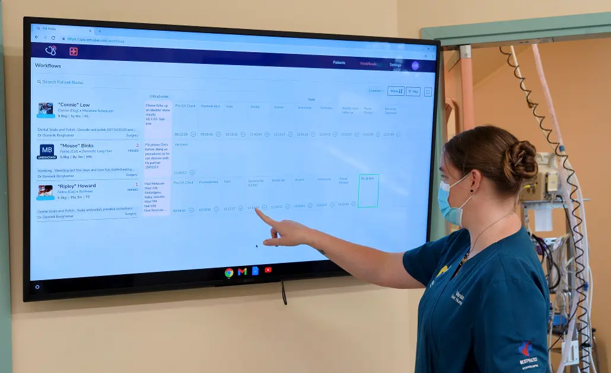

# Domain Context

Vet Radar used a NoSQL DB as it's primary DB store

This had several initial advantages for a product going through MVP development

- 🏎️ **Speed** - Reads and writes was superfast, didn't need to worry about I/O overheads
- 🏋️‍♀️ **Robust, reliable and scalable** - We could reliably scale without worry
- 🌈 **Flexible** - Very adaptable to changing data schemas (happening very often)

---

# Problem overview

During the development of our in-clinic dashboard, we ran into problems

- 🤮 **System load** - Engineers were making lots and lots of requests to get required data
- 🏔️ **Large datasets** - Requests resulted in large unfiltered datasets
- 🐢 **Speed** - Dashboards was not responsive to change, due to # of requests
- 🥵️ **Tedious dev** - Engineers found it very difficult reacting to change/feature requests (ex: data filtering)

---

# Problem overview - 2

Stakeholders started asking for more BI related features

- 📊 **Reporting** - Ability to generate various reporting
- 📈 **BI** - Business Intelligence / Dashboards
- 🩻 **Insights** - Engineers found it difficult to extract insights from data