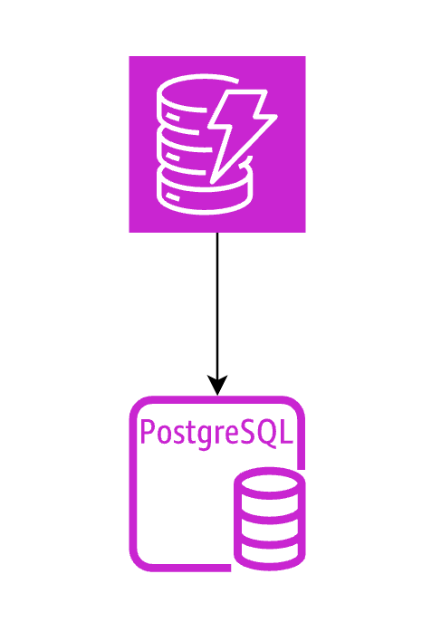
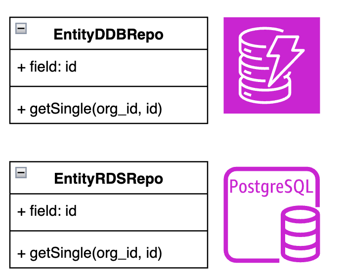
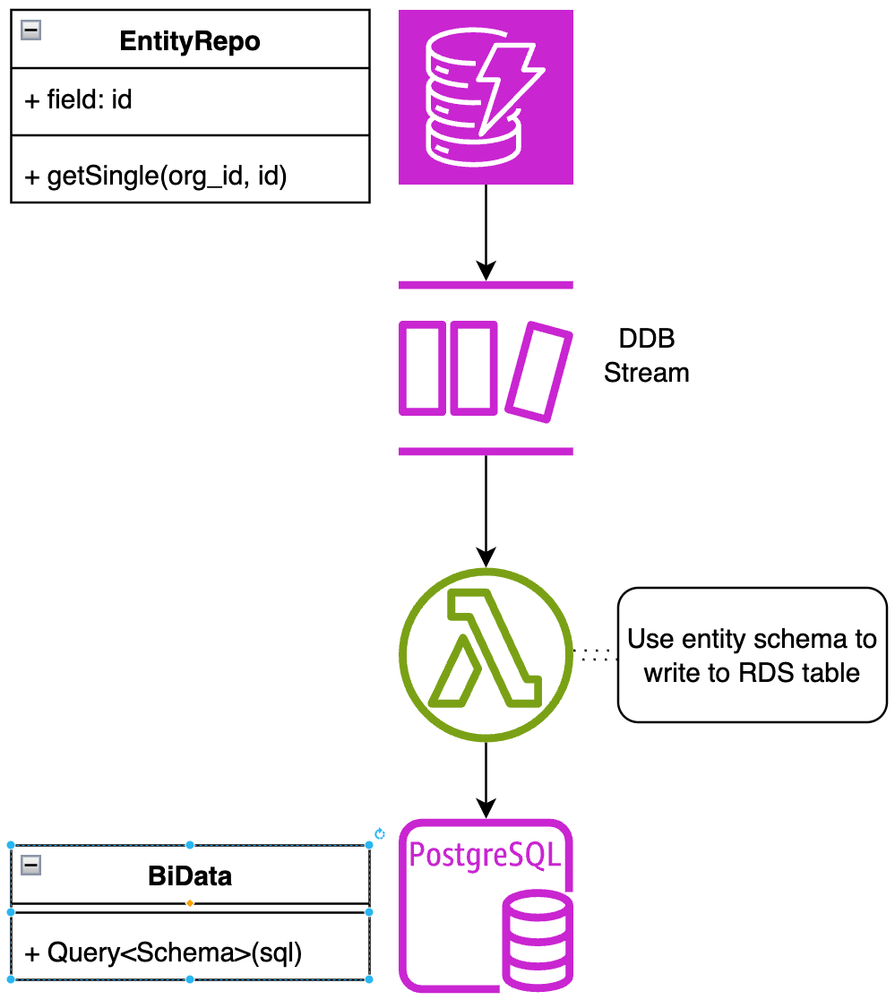

# Solution 1

Complete migration from 
AWS DynamoDB ➡️ Aurora RDS

|             |                                             |
|-------------|---------------------------------------------|
| Reporting   | ✅                                           |
| BI          | ✅                                           |
| Insights    | ✅                                           |
| Urgency     | ⚠️ Time consuming                           |
| Dev Ex      | ✅                                           |
| Scalable    | ❌ `Tasks` table is very I/O heavy and large |
| Maintenance | ✅                                           |
| No refactor | ❌ Large impact on codebase, downtime        |

⚠️ Performance unknown ❓

::right::

---
layout: two-cols
---

# Solution 2

Half-n-half
* Keep I/O heavy data in DDB `Tasks`
* Move all other data to RDS
* Small infrastructure footprint
* ⚠️ Any time `tasks` data is required would be a DDB Query

|             |                                      |
|-------------|--------------------------------------|
| Reporting   | ✅                                    |
| BI          | ✅                                    |
| Insights    | ✅                                    |
| Urgency     | ⚠️ Time consuming                    |
| Dev Ex      | ✅                                    |
| Scalable    | ❓Unsure / Unknown                    |
| Maintenance | ✅                                    |
| No refactor | ❌ Large impact on codebase, downtime |

::right::

---
layout: two-cols
---

# Solution 3

Replicate

* Stream DDB changes to Aurora RDS
* Aurora RDS becomes a read-only data store
* Minor impact on codebase
* ⚠️ Larger infra footprint, more things that can break

|             |                                            |
|-------------|--------------------------------------------|
| Reporting   | ✅                                          |
| BI          | ✅                                          |
| Insights    | ✅                                          |
| Urgency     | ✅                                          |
| Dev Ex      | ✅                                          |
| Scalable    | ✅                                          |
| Maintenance | ✅                                          |
| No refactor | ✅                                          |

::right::

---
transition: fade-out
layout: fact
---

## We ended up going with Solution 3